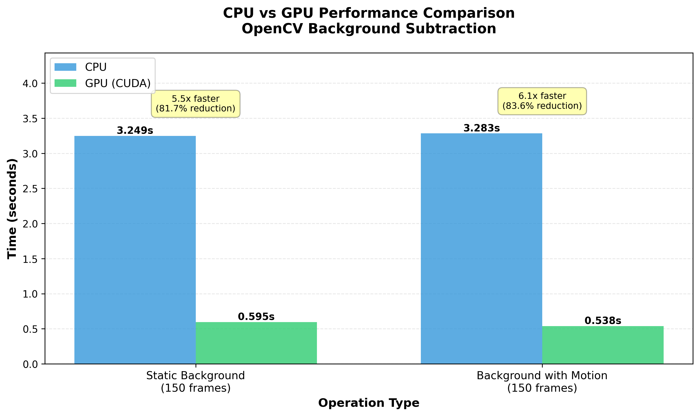
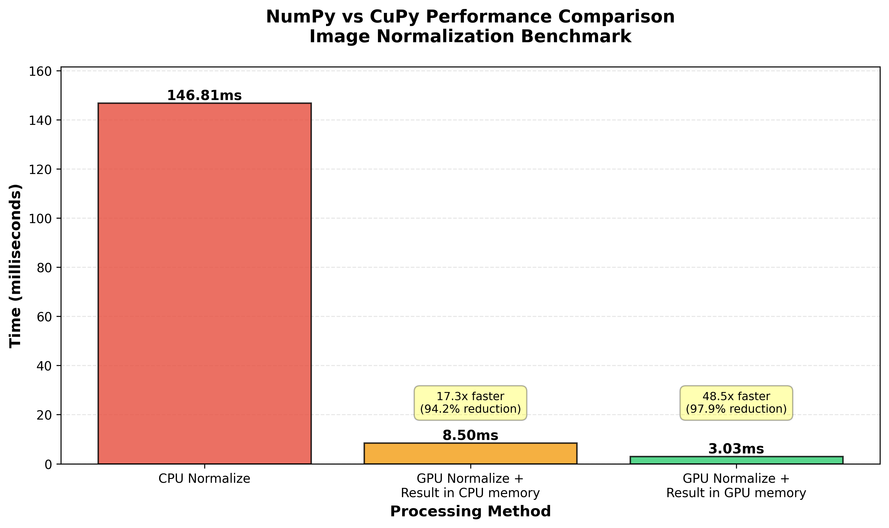

<p align="center">
  
</p>
---

# GPU vs CPU Benchmarking using OpenCV CUDA and CuPy

The repo provides example of gpu vs cpu benchmarking by utilizing OpenCV-CUDA and CuPy. [This blog](https://mirzafahad.github.io/2025-10-16-unlock-gpu-power/) explains the background and the results.

## Getting Started

1. Clone this repository:

```shell
git clone https://github.com/mirzafahad/opencv-cupy-cuda-benchmarks.git
```

2. If you don't have UV, [install it](https://github.com/astral-sh/uv).

3. You will also need OpenCV-CUDA and CUDA compiler. The blog explains how to install those.

4. Run these commands:

```shell
cd opencv-cupy-cuda-benchmarks
uv sync
```

5. Run the OpenCV-CUDA benchmarking script:

```bash
cd ~/opencv-cupy-cuda-benchmarks
uv run python src/benchmark/bg_subtraction_benchmark.py
```



6. Run the CuPy benchmarking script:

```bash
cd ~/opencv-cupy-cuda-benchmarks
uv run python src/benchmark/cupy_benchmark.py
```


   
